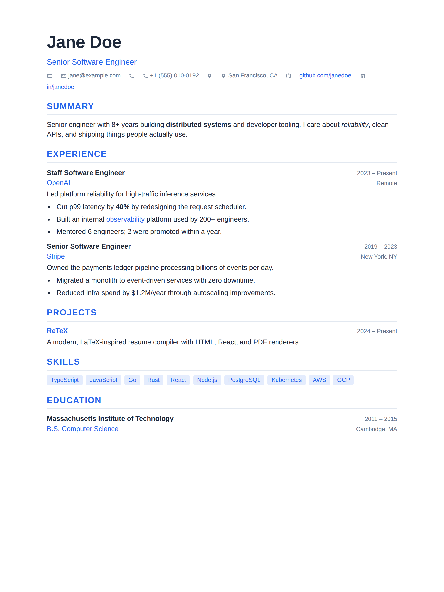
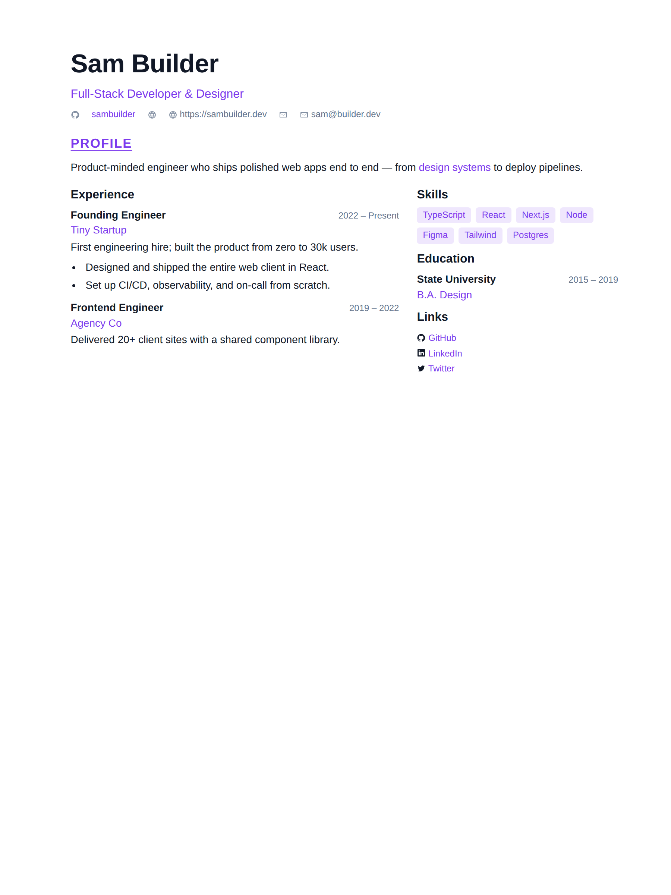
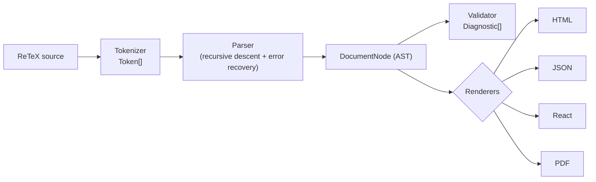

# ReTeX

**A modern, LaTeX-inspired markup language and compiler for resumes, research papers, and developer portfolios.**

[](LICENSE)
[](https://www.typescriptlang.org/)
[](#zero-dependencies)

ReTeX (a.k.a. **ResumeTeX**) gives you the clean, declarative authoring feel of
LaTeX without the toolchain. You write a small, readable markup language; ReTeX
tokenizes, parses, validates, and renders it to **HTML**, **React**, **JSON**, or
**PDF** — all from a single, dependency-free TypeScript library.

```latex
\name{Ada Lovelace}
\title{Software Engineer}
\email{ada@example.com}
\website{https://ada.dev}

\section{Experience}
\job{title=Senior Engineer, company=Analytical Engines, start=2021, end=Present}{
  Led the design of the first general-purpose compiler. Reduced build times by 40%.
}
```

---

## Preview

The three [examples](examples/) rendered to HTML (default, modern, and classic
themes). Regenerate with `npx tsx examples/build.ts`.

| Single column (`default`) | Two column (`modern`) | Academic CV (`classic`) |
| --- | --- | --- |
| [](examples/software-engineer.retex) | [](examples/two-column.retex) | [](examples/research-paper.retex) |

---

## What ReTeX is — and is not

ReTeX **is** a focused markup language for *documents about people and projects*:
résumés, CVs, academic bio pages, and developer portfolios. It ships a curated
set of commands (`\name`, `\job`, `\education`, `\skills`, `\section`, …), strong
theming, and four production-ready renderers.

ReTeX **is not** a full LaTeX implementation. There is no math mode, no macro
programming, no package ecosystem, no `\def`. The syntax is *LaTeX-inspired* —
familiar braces and backslash commands — but the language is deliberately small,
safe, and predictable. (Notably, `%` is a literal percent sign, not a comment;
see [Syntax](docs/SYNTAX.md).)

---

## Features

- **Typography** — `\textbf`, `\textit`, `\emph`, `\underline`, `\sout`,
  `\textcolor`, `\fontsize`, `\fontfamily`, and scoped switches (`\small`,
  `\large`, `\Large`, `\Huge`, `\bfseries`, `\itshape`, `\ttfamily`).
- **Hyperlinks** — `\href{url}{label}` and `\url{url}`, with URL sanitization.
- **Sections** — `\section` and `\subsection`.
- **Résumé components** — `\name`, `\title`, `\email`, `\phone`, `\location`,
  `\website`, and rich entries `\job`, `\education`, `\project`, `\skills`.
- **Lists & layout** — `itemize`, `enumerate`, and a flexible `columns`
  environment.
- **Icons** — inline SVG icon set (`\icon{github}`, `\icon{linkedin}`, …),
  extensible at runtime.
- **Theming** — four presets (`default`, `modern`, `classic`, `compact`) plus a
  fully data-driven, deep-mergeable custom theme model.
- **Plugins** — register new commands, environments, icons, renderers, or theme
  patches on a per-engine basis. Two example plugins ship in the box
  (`badgePlugin`, `ratingPlugin`).
- **Four renderers** — HTML fragments and full documents, a framework-agnostic
  React element tree, a structured JSON AST, and print-ready HTML/PDF.
- **Editor tooling** — completion, hover docs, semantic tokens, diagnostics,
  formatting, and AST inspection via `EditorService`.
- **Incremental parsing** — block-level caching for fast live preview.
- **Security** — every text node and attribute is escaped; every URL is vetted.
  No `eval`, no `Function`, no code execution of source.
- <a name="zero-dependencies"></a>**Zero runtime dependencies.** React and
  Puppeteer are *optional* peers used only if you opt into React/PDF output.

---

## Install

```bash
npm install retex
```

React is an **optional peer dependency** — install it only if you use the React
renderer:

```bash
npm install react
```

PDF export lazily imports `puppeteer` if present; otherwise you can supply your
own headless-browser launcher (Playwright, a pooled Chromium, etc.) or print the
generated HTML to PDF in the browser.

The package exposes two entry points:

| Import path     | Contents                                              |
| --------------- | ----------------------------------------------------- |
| `retex`         | The engine, pipeline, AST utilities, all renderers\*, theming, plugins, security, icons, editor, incremental compiler. |
| `retex/react`   | The React renderer (`ReactRenderer`, `renderReact`).  |

\* The React renderer is also re-exported from `retex`, but lives behind
`retex/react` so the core bundle never imports React.

---

## Quick start

```ts
import { ReTeXEngine } from "retex";

const engine = new ReTeXEngine();

const source = String.raw`
\name{Ada Lovelace}
\title{Software Engineer}
\email{ada@example.com}

\section{Experience}
\job{title=Senior Engineer, company=Analytical Engines, start=2021, end=Present}{
  Designed the first general-purpose compiler.
}
`;

// A clean HTML fragment:
const html = engine.toHtml(source);

// …or a complete, styled, standalone page:
const page = engine.toHtmlDocument(source, { title: "Ada Lovelace — Résumé" });

// The stylesheet for the active theme, if you render the fragment yourself:
const css = engine.styles();
```

`engine.toHtml` accepts either a source string or a parsed `DocumentNode`, so you
can parse once and render to several targets.

---

## A realistic résumé

```latex
%% --- header ---
\name{Grace Hopper}
\title{Distinguished Engineer \& Compiler Pioneer}
\email{grace@example.com}
\phone{+1 (555) 010-1999}
\location{Arlington, VA}
\website{https://gracehopper.dev}

\section{Summary}
Systems engineer with 30+ years building compilers and developer tools.
Coined the term \emph{debugging}. Reduced batch latency by 60%.

\section{Experience}
\job{title=Distinguished Engineer, company=US Navy, location=Washington, DC, start=1959, end=1986}{
  \begin{itemize}
    \item Led development of \textbf{COBOL}, the first English-like programming language.
    \item Built the first compiler, \textbf{A-0}, decades ahead of its time.
  \end{itemize}
}

\job{title=Senior Mathematician, company=Eckert--Mauchly, start=1949, end=1959}{
  Programmed the UNIVAC I; pioneered machine-independent programming.
}

\section{Education}
\education{school=Yale University, degree=PhD Mathematics, start=1930, end=1934}
\education{school=Vassar College, degree=BA Mathematics \& Physics, end=1928}

\section{Skills}
\skills{Compilers, COBOL, Systems Programming, Mentorship, Public Speaking}

\section{Links}
\icon{github} \href{https://github.com/gracehopper}{github.com/gracehopper}
\hspace{1em}
\icon{linkedin} \href{https://linkedin.com/in/gracehopper}{LinkedIn}
```

See the full language reference in **[docs/SYNTAX.md](docs/SYNTAX.md)**.

---

## Compiler pipeline

ReTeX is a real compiler with four well-separated stages. Each stage is pure,
never throws, and threads precise source ranges through so diagnostics map back
to the exact bytes the author typed.

```
  ReTeX source
       │
       ▼
┌──────────────┐   tokens      ┌──────────────┐   AST        ┌──────────────┐   diagnostics   ┌──────────────┐
│  Tokenizer   │ ────────────▶ │   Parser     │ ───────────▶ │  Validator   │ ──────────────▶ │  Renderers   │
│  (lexer)     │               │ (recursive   │              │ (semantic    │                 │ HTML / React │
│              │               │  descent +   │              │  checks)     │                 │ JSON / PDF   │
│              │               │  recovery)   │              │              │                 │              │
└──────────────┘               └──────────────┘              └──────────────┘                 └──────────────┘
       │                              │                              │                                │
   Token[]                      DocumentNode                  Diagnostic[]                    string / element /
                                                                                              JSON / Uint8Array
```



- **Tokenizer** — `tokenize(source)` → `{ tokens, diagnostics }`. Permissive,
  never throws. Handles ReTeX's resume-friendly lexing (`%` literal, `%%`
  comments, escapes, `\\` line breaks, blank-line paragraph breaks).
- **Parser** — recursive-descent, fully error-recovering. Consults the
  **command registry** for argument signatures and AST builders, handles scoped
  font switches and `\begin…\end` environments, and emits "did you mean?"
  suggestions for unknown commands.
- **Validator** — semantic checks over the AST (empty sections, stray `\item`,
  unknown theme colors, …). Pure and optional.
- **Renderers** — share structuring helpers (`toRegions`, `splitPreamble`,
  `entryParts`) so every target produces the same logical layout.

Read the deep dive in **[docs/ARCHITECTURE.md](docs/ARCHITECTURE.md)**.

---

## Rendering

### HTML

```ts
const engine = new ReTeXEngine();

engine.toHtml(source);                       // fragment: <div class="retex-resume">…</div>
engine.toHtmlDocument(source, { title: "CV" }); // full <!DOCTYPE html> page with <style>
engine.styles();                             // the theme's CSS (for the fragment case)
```

Or use the stage functions directly:

```ts
import { tokenize, parse, validate, renderHtml } from "retex";

const { ast } = parse(tokenize(source).tokens);
const diagnostics = validate(ast);
const html = renderHtml(ast, { classPrefix: "cv" });
```

### React

The React renderer has **no hard dependency on React** — you pass the JSX
factory yourself, so it works with React, Preact, or any compatible runtime.

```tsx
import React from "react";
import { ReTeXEngine } from "retex";

function Resume({ source }: { source: string }) {
  const engine = React.useMemo(() => new ReTeXEngine(), []);
  const tree = engine.toReact(source, {
    createElement: React.createElement,
    Fragment: React.Fragment,
  });
  return (
    <>
      <style>{engine.styles()}</style>
      {tree as React.ReactNode}
    </>
  );
}
```

Standalone, via the dedicated subpath:

```tsx
import React from "react";
import { renderReact } from "retex/react";
import { parse, tokenize } from "retex";

const { ast } = parse(tokenize(source).tokens);
const element = renderReact(ast, {
  createElement: React.createElement,
  Fragment: React.Fragment,
});
```

### JSON

```ts
engine.toJson(source);                       // pretty-printed AST
engine.toJson(source, { stripMeta: true });  // drop range/hash for stable diffs
```

### PDF

```ts
// Print-ready, standalone HTML (no browser required):
const printHtml = engine.toPrintHtml(source, { title: "Résumé" });

// A PDF byte buffer (lazily imports puppeteer, or pass your own launcher):
const pdf: Uint8Array = await engine.toPdf(source);

// Bring your own headless browser (e.g. Playwright):
const pdf2 = await engine.toPdf(source, {
  launch: async () => myPlaywrightBrowserAdapter(),
});
```

---

## Theming

Themes are plain data, deep-merged over the default. Pass a full `Theme` or a
partial patch.

```ts
import { ReTeXEngine, modernTheme } from "retex";

// Use a preset:
const a = new ReTeXEngine({ theme: modernTheme });

// Or a partial override (deep-merged over the default):
const b = new ReTeXEngine({
  theme: {
    name: "brand",
    colors: { primary: "#7c3aed", text: "#0f172a" },
    fonts: { heading: '"Space Grotesk", system-ui, sans-serif' },
    sectionStyle: "underline",
  },
});

// Swap at runtime:
b.setTheme({ colors: { primary: "#059669" } });
```

Presets: `defaultTheme`, `modernTheme`, `classicTheme`, `compactTheme` (also
available by name via `getTheme("modern")` or the `themes` map). Every theme
color is exposed as a CSS variable (`--retex-color-<token>`), usable from
`\themecolor{token}{…}`.

---

## Plugins

A plugin can contribute commands, environments, icons, render overrides, and
theme patches. The simplest case — a custom inline command with a render
function and no custom AST node:

```ts
import { ReTeXEngine } from "retex";

const engine = new ReTeXEngine();

engine.registerCommand({
  name: "badge",
  category: "inline",
  args: [{ kind: "content", name: "label" }],
  summary: "A small inline badge.",
  example: "\\badge{New}",
  render: {
    html: (node, ctx, renderChildren) => {
      const inner = renderChildren((node as any).args[0]?.children ?? []);
      return `<span class="${ctx.cls("badge")}">${inner}</span>`;
    },
  },
});

engine.toHtml("\\badge{Open to work}");
```

Or package it as a reusable plugin and install with `.use()`:

```ts
import { ReTeXEngine, badgePlugin, ratingPlugin } from "retex";

const engine = new ReTeXEngine({ plugins: [badgePlugin, ratingPlugin] });
engine.toHtml("\\badge{New} \\rating{4}");
```

`badgePlugin` is the canonical reference for a plugin that ships both HTML and
React renderers; `ratingPlugin` shows a `string` argument with an HTML-only
override. See **[docs/API.md](docs/API.md)** for the full `ReTeXPlugin` contract.

---

## Editor integration

`EditorService` provides everything a Monaco/CodeMirror/LSP integration needs.
All methods are pure and synchronous.

```ts
import { EditorService } from "retex";

const editor = new EditorService();

editor.getCompletions(source, offset);  // CompletionItem[] (commands, envs, fields)
editor.getHover(source, offset);        // HoverInfo | null (markdown docs)
editor.getSemanticTokens(source);       // SemanticToken[] (highlighting)
editor.getDiagnostics(source);          // Diagnostic[] (errors/warnings/hints)
editor.format(source);                  // canonical, re-printed source
editor.inspect(source);                 // DocumentNode (for debugging)
```

Diagnostics carry stable codes (e.g. `RTX2001` for an unknown command) plus
optional quick-fixes, so editors can wire up code actions and doc links.

---

## Security

ReTeX renders untrusted markup, so safety is built into every layer:

- **HTML escaping** — every text node and attribute value is escaped
  (`escapeHtml`, `escapeAttribute`).
- **URL sanitization** — `sanitizeUrl` allow-lists safe protocols
  (`http`, `https`, `mailto`, `tel`, `ftp`, `sms`), strips obfuscating control
  characters, and blocks `javascript:`, `data:`, `vbscript:`, `file:` and
  friends. URLs are vetted at parse time *and* re-checked at render time.
- **CSS value vetting** — colors (`isSafeColor`) and dimensions
  (`isSafeDimension`) are validated before they reach a `style` attribute, so
  no `expression(...)` or `url(javascript:…)` can be smuggled in.
- **No code execution** — the engine never uses `eval`, `Function`, or
  template-string interpolation of user input into executable contexts.

---

## Performance & incremental parsing

The engine caches compiled documents (LRU, configurable via `cacheSize`). For
live editing, the `IncrementalCompiler` splits the document into balanced blocks
at blank-line boundaries and caches each block by its exact text — so editing one
paragraph re-parses only that block while the rest are served from cache and
cheaply re-positioned.

```ts
import { IncrementalCompiler } from "retex";

const inc = new IncrementalCompiler();
const { ast, diagnostics, stats } = inc.compile(source);
// stats: { segments, cacheHits, cacheMisses }
```

---

## Scripts

```bash
npm run build       # bundle with tsup (ESM + CJS + d.ts)
npm run typecheck   # tsc --noEmit
npm test            # run the test suite (vitest)
npm run test:watch  # watch mode
npm run test:cov    # coverage
npm run bench       # performance benchmarks
npm run lint        # eslint
npm run format      # prettier
```

---

## Documentation

- **[docs/SYNTAX.md](docs/SYNTAX.md)** — the complete language reference: every
  command and environment, plus ReTeX's lexing rules.
- **[docs/API.md](docs/API.md)** — the public TypeScript API, grouped by area.
- **[docs/ARCHITECTURE.md](docs/ARCHITECTURE.md)** — how the compiler works,
  end to end, and how to extend it.

---

## Contributing

Contributions are welcome. The codebase is strict TypeScript with a layered
architecture (`tokenizer` → `parser` → `validator` → `renderers`) and broad test
coverage. Please run `npm run typecheck`, `npm test`, and `npm run lint` before
opening a PR.

## License

[MIT](LICENSE) © ReTeX contributors.
